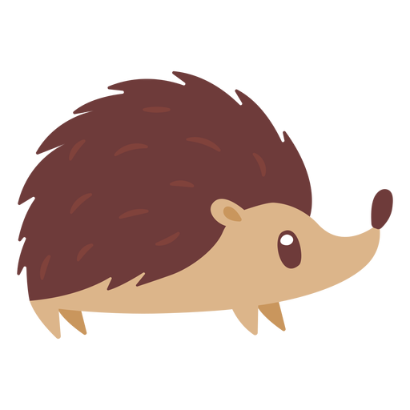

<a name="readme-top"></a>

<!-- PROJECT LOGO -->
<br />
<div align="center">
  <a href="https://github.com/corners2wall/Art-blog">
    
  </a>

  <h3 align="center">Art Landing</h3>

  <p align="center">
    Great design for amazing results
    <br />
    <a href="https://my-awesome-art-blog.netlify.app/"><strong>See magic</strong></a>
  </p>
</div>


<!-- TABLE OF CONTENTS -->
<details>
  <summary>Table of Contents</summary>
  <ol>
    <li>
      <a href="#about-the-project">About The Project</a>
      <ul>
        <li><a href="#built-with">Built With</a></li>
      </ul>
    </li>
    <li>
      <a href="#getting-started">Getting Started</a>
      <ul>
        <li><a href="#prerequisites">Prerequisites</a></li>
        <li><a href="#installation">Installation</a></li>
      </ul>
    </li>
    <li><a href="#contributing">Contributing</a></li>
    <li><a href="#contact">Contact</a></li>
  </ol>
</details>


<!-- ABOUT THE PROJECT -->
## About The Project

Deploy: [awesome-art-blog](https://my-awesome-art-blog.netlify.app/)

[![Product Name Screen Shot][product-screenshot]](https://my-awesome-art-blog.netlify.app/)

Only creative design and good work. Only this will help you create a good product that people will use

<p align="right">(<a href="#readme-top">back to top</a>)</p>

### Built With

Core libraries used to bootstrap this blog:

* React;

* Tailwind;
* Three.js.

<p align="right">(<a href="#readme-top">back to top</a>)</p>

<!-- GETTING STARTED -->
## Getting Started

Simply instructions for setup and run a project.
To get a local copy up and running follow these simple example steps.

### Prerequisites

All you need is node and yarn
* node
    - download lates [node](https://nodejs.org/en)
* yarn
  ```sh
  npm install --global yarn
  ```

### Installation

_To run or for debugging purposes, simply run the following commands:_

1. Clone the repo:
   ```sh
   git clone https://github.com/corners2wall/Art-blog
   ```
2. Install NPM packages:
   ```sh
   yarn install
   ```
3. Run project:
    ```
    yarn dev
    ```

<p align="right">(<a href="#readme-top">back to top</a>)</p>


<!-- CONTRIBUTING -->
## Contributing

Contributions are what make the open source community such an amazing place to learn, inspire, and create. Any contributions you make are **greatly appreciated**.

If you have a suggestion that would make this better, please fork the repo and create a pull request. You can also simply open an issue with the tag "enhancement".
Don't forget to give the project a star! Thanks again!

1. Fork the Project
2. Create your Feature Branch (`git checkout -b feature/AmazingFeature`)
3. Commit your Changes (`git commit -m 'Add some AmazingFeature'`)
4. Push to the Branch (`git push origin feature/AmazingFeature`)
5. Open a Pull Request

<p align="right">(<a href="#readme-top">back to top</a>)</p>


<!-- CONTACT -->
## Contact

Telegram - [@corners2wall](https://t.me/corners2wall)

Project Link: [https://github.com/corners2wall/Art-blog](https://github.com/corners2wall/Art-blog)

Deploy: [awesome-art-blog](https://my-awesome-art-blog.netlify.app/)

<p align="right">(<a href="#readme-top">back to top</a>)</p>

[product-screenshot]: images/preview.png